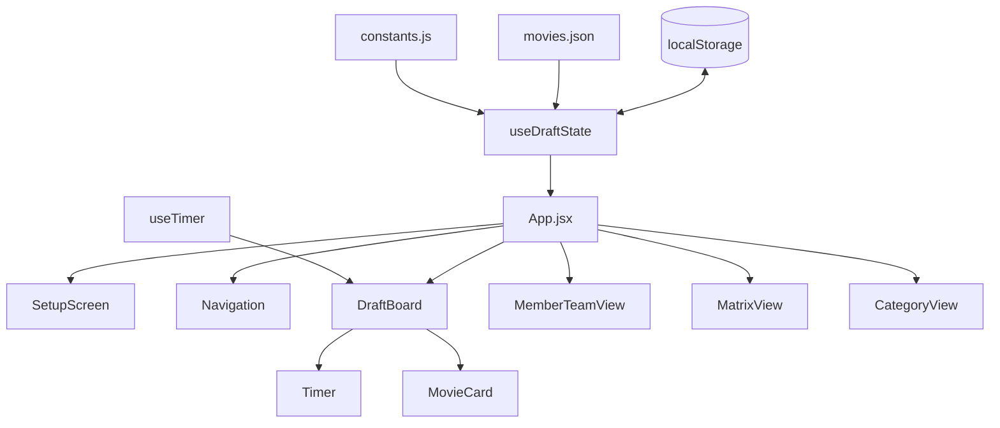

# Movie Draft MVP - Phase Progress

## Project Overview
Fantasy movie draft app for 6 friends to draft movies into 6 categories from a pool of 100 films.

## Architecture



## Sprint Plan

### Day 0: Setup & Data (TODAY) ✅
| Task | Status | Notes |
|------|--------|-------|
| Project scaffold (Vite + React) | ✅ Complete | |
| Tailwind CSS setup | ✅ Complete | |
| Movie data JSON (100 titles) | ✅ Complete | |
| TMDB poster fetch script | ✅ Complete | Needs API key to run |
| Constants (members, categories) | ✅ Complete | |

### Day 1: Core State & Setup Screen ✅
| Task | Status | Notes |
|------|--------|-------|
| useDraftState hook | ✅ Complete | Snake draft, localStorage |
| useTimer hook | ✅ Complete | Pause, reset, time's up |
| SetupScreen component | ✅ Complete | Name editing, randomize |
| localStorage persistence | ✅ Complete | Auto-save on changes |

### Day 2: Live Draft Board ✅
| Task | Status | Notes |
|------|--------|-------|
| DraftBoard layout | ✅ Complete | 2-column layout |
| "On the Clock" indicator | ✅ Complete | |
| Available movies grid | ✅ Complete | |
| Search functionality | ✅ Complete | Real-time filter |
| Pick flow | ✅ Complete | Select + confirm |
| Timer with pause | ✅ Complete | Color changes at 60s/30s |
| Undo capability | ✅ Complete | Full history |

### Day 3: Secondary Views ✅
| Task | Status | Notes |
|------|--------|-------|
| Navigation component | ✅ Complete | Tab-style nav |
| MemberTeamView | ✅ Complete | Dropdown selector |
| MatrixView | ✅ Complete | Scrollable table |
| CategoryView | ✅ Complete | Grid layout |

### Day 4: Polish & Testing
| Task | Status | Notes |
|------|--------|-------|
| Fetch movie posters | ⏳ Pending | Need TMDB API key |
| Edge case testing | ⏳ Pending | |
| Keyboard accessibility | ⏳ Pending | |
| Full draft simulation | ⏳ Pending | |
| Visual polish | ⏳ Pending | |
| Draft Board Grid redesign (Sequential snake view) | ✅ Complete | Implemented in `movie-draft-app/src/components/DraftBoardGrid.jsx` |

## Blockers

1. **TMDB API Key Required**: Need to get a free API key from https://www.themoviedb.org/settings/api to fetch poster images

## Next Steps

1. Get TMDB API key
2. Run poster fetch script: `TMDB_API_KEY=xxx node scripts/fetch-posters.js`
3. Test full draft flow
4. Polish any UI issues

## Files Created

```
movie-draft-app/
├── src/
│   ├── components/
│   │   ├── SetupScreen.jsx
│   │   ├── DraftBoard.jsx
│   │   ├── MemberTeamView.jsx
│   │   ├── MatrixView.jsx
│   │   ├── CategoryView.jsx
│   │   ├── MovieCard.jsx
│   │   ├── Timer.jsx
│   │   └── Navigation.jsx
│   ├── hooks/
│   │   ├── useDraftState.js
│   │   └── useTimer.js
│   ├── data/
│   │   ├── movies.json
│   │   └── constants.js
│   ├── App.jsx
│   └── index.css
├── scripts/
│   └── fetch-posters.js
├── README.md
└── package.json
```
